<!-- Line Animation -->
</img>
<!-- End Line Animation -->

<!-- Count visiter -->

<!-- End Count visiter -->

<!-- Intro -->

<!-- End Intro -->

<!-- Line Animation -->
</img>
<!-- End Line Animation -->

<!-- Contatos -->
<h3 align="left"> Contato:</h3>

 
  
  
  
   

<!-- End Contatos -->

<!-- List Projects -->
###  📚 Lista de Projetos

  
 Expandir 

  <a href="https://github.com/AyltonAguiar/northwind">
  

<!-- List Projects -->
  
<!-- End github statistic-->
### 📊 Github Estatístico

Expandir

  
<table>
  <tr>
    <td valign="top" width="50%">
       
      
    </td>
    <td valign="top" width="50%">
      
    </td>
  </tr>
  </table>
  
  <table>
    <tr>
      <td valign="top" width="50%">
        
      </td>
      <td valign="top" width="50%">
        
      </td>
    </tr>
  </table>

<!-- End github statistic-->

<!-- Language Graphics -->
### 📊 Linguagens Usadas

  
Expandir

  

<table>
    <tr>
      <td valign="top" width="50%">
        <h3 align="left">Tech Stack:</h3>
        

  
 
    <a href="https://aws.amazon.com" target="_blank"> 
    <a href="https://console.cloud.google.com" target="_blank"> 
  

  

    <a href="https://www.mongodb.com" target="_blank"> 
    <a href="https://www.postgresql.org" target="_blank"> 
    <a href="https://www.microsoft.com/en-us/sql-server/sql-server-downloads" target="_blank"> 
  

  

    <a href="https://code.visualstudio.com" target="_blank"> 
    <a href="https://www.python.org" target="_blank"> 
  

  

    <a href="https://www.getdbt.com" target="_blank"> 
  

      
  </td>
    <td valign="top" width="50%">
      <h3 align="left">Conquistas:</h3>
      

        
    </td>
    </tr>
</table>
<!-- End Language Graphics -->
      
<!-- Line Animation -->
</img>
<!-- End Line Animation -->
    
<!-- Snake Animation -->

 </img>
<!-- End Snake Animation -->
